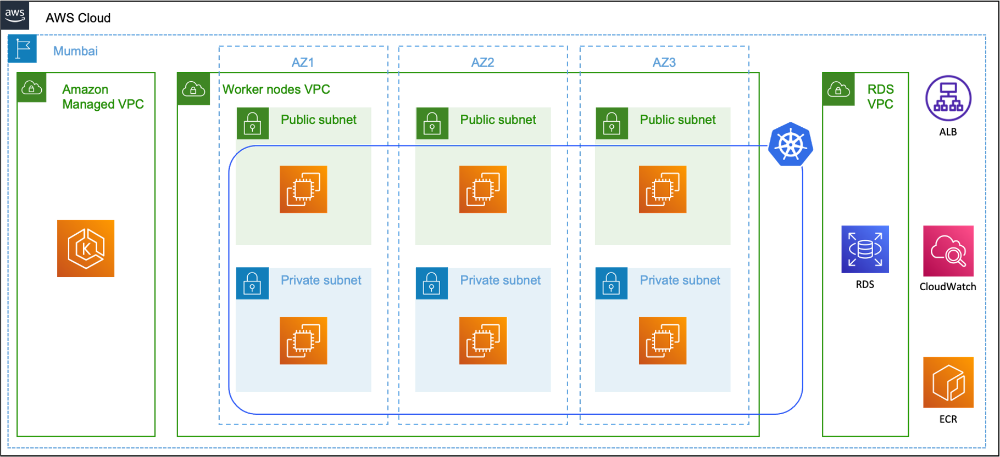
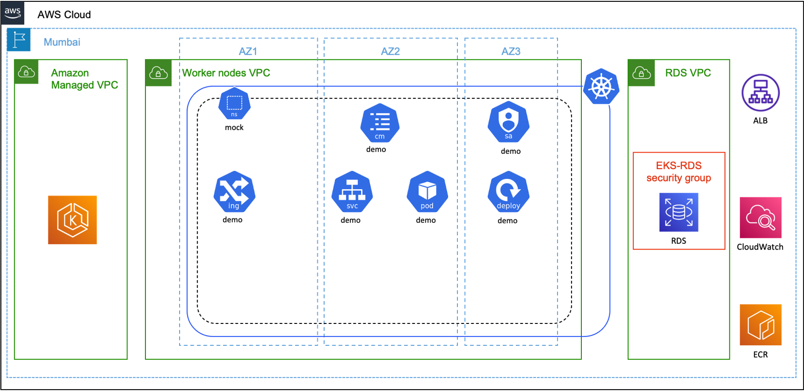

# Introduction

This repository documents the mock test.

- [Introduction](#introduction)
  - [Overview](#overview)
  - [Architecture](#architecture)
    - [Cloud](#cloud)
    - [Cluster](#cluster)
  - [Test](#test)
    - [Cloud](#cloud-1)
      - [Amazon RDS](#amazon-rds)
      - [Amazon CloudWatch](#amazon-cloudwatch)
      - [Amazon ECR](#amazon-ecr)
      - [Amazon IAM](#amazon-iam)
    - [Cluster](#cluster-1)
      - [Amazon EKS](#amazon-eks)
      - [Kubernetes objects](#kubernetes-objects)
    - [Container](#container)
  - [Result](#result)
    - [ARN](#arn)
    - [Kubernetes objects](#kubernetes-objects-1)
    - [Result of API invocation](#result-of-api-invocation)

## Overview

By end of this mock test, the participants should be able to invoke an API, hosted in Kubernetes cluster, that queries a MySQL database on Amazon RDS successfully.

## Architecture

The participants are expected to implement the following architecture successfully.

### Cloud



### Cluster



## Test

The mock test requires implementation of the architecture diagrams shown above. The requirements can be organised into four sections viz. Cloud, Cluster, Container and Code as seen in the figure below.


- The **Code** layer is already implemented in the `app` folder. Rest of the layers are to be developed.
- At least, one aspect of Security and monitoring must be implemented.
- Implementation of automation is optional.

### Cloud

The **Cloud** layer is to be implemented is described in the subsequent sections.

#### Amazon RDS

1. Launch an Amazon RDS database in the default VPC of your AWS account.
2. Allow traffic into Amazon RDS database from the NAT gateway of the Amazon EKS VPC.
3. Enable [authentication with IAM](https://aws.amazon.com/premiumsupport/knowledge-center/users-connect-rds-iam/).

#### Amazon CloudWatch

1. Implement at least one [detective control](https://aws.github.io/aws-eks-best-practices/security/docs/detective/) on the Amazon EKS control plane logs.
2. Enable [Amazon CloudWatch Container Insights](https://www.eksworkshop.com/intermediate/250_cloudwatch_container_insights/) to monitor the performance of the Amazon EKS cluster.

#### Amazon ECR

1. Launch an Amazon ECR registry with at least one of the features enabled.
   1. Immutable tags.
   2. Scan on push.
   3. Encrypted images.

#### Amazon IAM

### Cluster

The **Cluster** layer is to be implemented is described in the subsequent sections.

#### Amazon EKS

1. Launch an Amazon EKS cluster that satisfies the following conditions
   1. 1 instance of type `t3.small` with label as `workload: web`.
   2. 1 instance of type `t3.small` with label as `workload: db`.

#### Kubernetes objects

1. `ns/mock`
2. `mock/deployment/demo`
3. `mock/cm/demo`
4. `mock/svc/demo`
5. `mock/ing/demo`
6. `mock/sa/demo`

### Container

1. Create `Dockerfile` to build container image for the application in the `app` folder.
2. Build and push the container image to Amazon ECR.

## Result

### ARN

Populate the following results table.

| Item       | ARN |
| ---------- | --- |
| Amazon RDS |     |
| AWS IAM    |     |
| Amazon EKS |     |
| Amazon ECR |     |

### Kubernetes objects

1. Paste the result of the command `kubectl -n mock get all`.

```bash
# Run kubectl -n mock get all and paste here.
NAME                        READY   STATUS    RESTARTS   AGE
pod/demo-77748bbf6b-xpjmq   1/1     Running   0          24m

NAME           TYPE       CLUSTER-IP      EXTERNAL-IP   PORT(S)        AGE
service/demo   NodePort   10.100.84.135   <none>        80:30797/TCP   39m

NAME                   READY   UP-TO-DATE   AVAILABLE   AGE
deployment.apps/demo   1/1     1            1           45m

NAME                              DESIRED   CURRENT   READY   AGE
replicaset.apps/demo-77748bbf6b   1         1         1       45m
```

2. Describe `demo/sa/demo`.

```bash
# kubectl -n demo describe sa/demo
Name:                demo
Namespace:           demo
Labels:              app.kubernetes.io/managed-by=eksctl
Annotations:         eks.amazonaws.com/role-arn: arn:aws:iam::6892xxxxxx07:role/eksctl-mock-addon-iamserviceaccount-demo-dem-Role1-1XFZU62UYF44A
Image pull secrets:  <none>
Mountable secrets:   demo-token-2rktf
Tokens:              demo-token-2rktf
Events:              <none>
```

### Result of API invocation

1. Get the DNS of ALB provisioned.

```bash
ALB_DNS=`kubectl -n demo get ing/demo -o jsonpath='{.status.loadBalancer.ingress[0].hostname}'`
echo ${ALB_DNS}
```

2. Paste the result of API invocation - `curl -s -X GET http://${ALB_DNS}/demo/ts` and past here.

```json
{"ts":"2022-09-29T14:50:47.000Z"}
```
